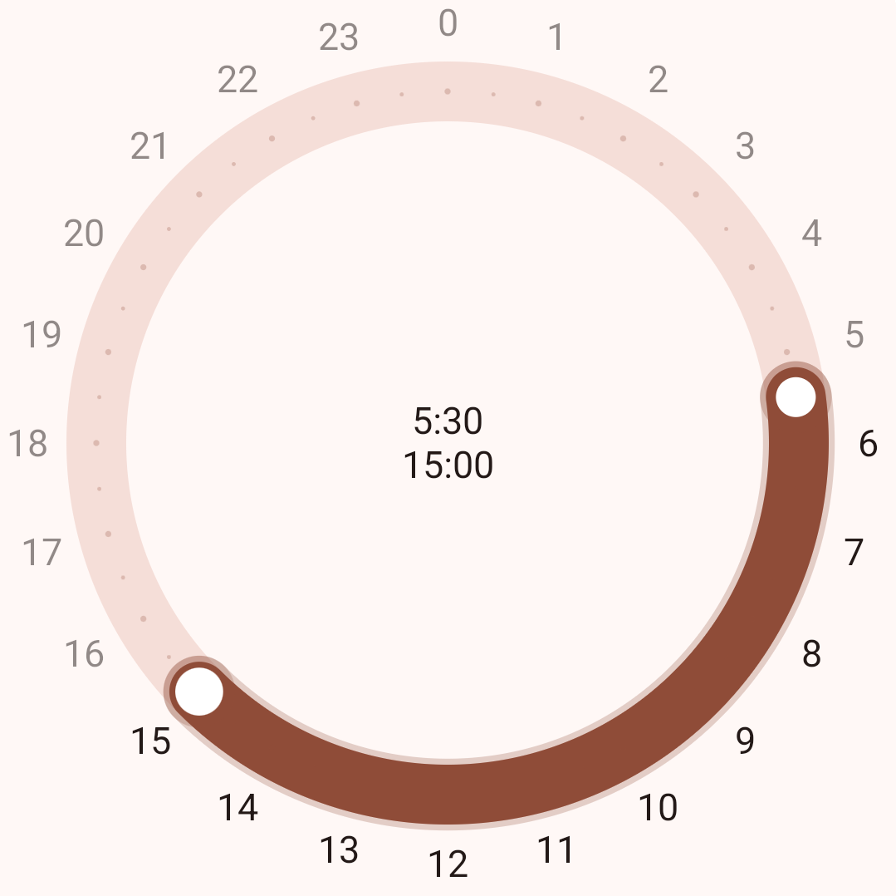
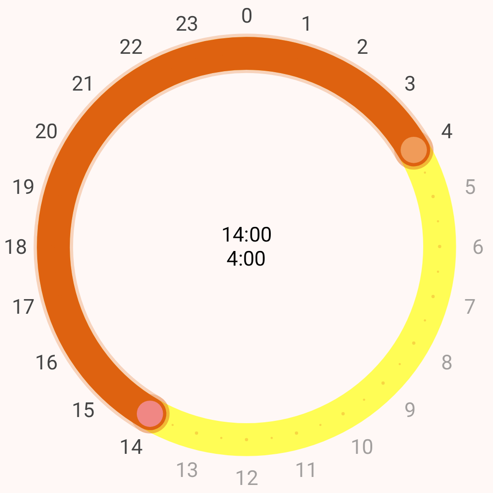

# TimeRangePicker

Similar to the [original](https://developer.android.com/develop/ui/compose/components/time-pickers)
TimePicker but this library is for picking a range of time.

## Preview

### Image



### Video

https://github.com/user-attachments/assets/08941f72-3037-440a-96b5-b842156f6c9b

## Compatibility

SDK 24+ or Android 7.0+

## Usage

### Simple

```kotlin
val state = rememberTimeRangePickerState(
    start = Random.nextInt(0..23).toFloat(),
    end = Random.nextInt(0..23).toFloat()
)
TimeRangePicker(
    state = state
)
```

### Advanced

```kotlin
TimeRangePicker(
    state = state,
    ringColor = Color(0xffFFFD55),
    selectedArcColor = Color(0xffDE6210),
    centerTextColor = Color.Black,
    ringTextColor = Color.DarkGray,
    startColor = Color(0xffF08784),
    endColor = Color(0xffF09B59),
)
```

#### State

You can also access or change state directly if you want.

```kotlin
Text(
    text = state.start.toString()
)
```

```kotlin
state.end = 12f
```



## Install

```kotlin
implementation("ir.yamins.timerangepicker:timerangepicker-jvm:1.0.1")
```

## License

TimeRangePicker is free software: you can redistribute it and/or modify
it under the terms of the GNU General Public License as published by
the Free Software Foundation, either version 3 of the License, or
(at your option) any later version.

Gauge is distributed in the hope that it will be useful,
but WITHOUT ANY WARRANTY; without even the implied warranty of
MERCHANTABILITY or FITNESS FOR A PARTICULAR PURPOSE. See the
GNU General Public License for more details.

You should have received a copy of the GNU General Public License
along with Gauge. If not, see <https://www.gnu.org/licenses/>.
